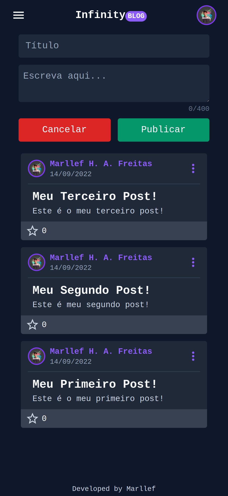

# Infinity Blog

_Um blog para publicar pensamentos cotidianos._

## Tecnologias Utilizadas

Estas são algumas das tecnologias utilizadas na elaboração deste projeto.

<div align='center'>


</div>

## Telas

Algumas das telas do aplicativo:

<div align='center' >

  
  
  
  

</div>

# Informações

- Para executar este projeto localmente siga as etapas descritas neste documento.

- Uma versão funcional deste projeto pode ser acessado [clicando aqui](http://linktoo.tk).

## Pré-requisitos

Antes de iniciar é necessário ter o `yarn` instalado.

```sh
npm install -g yarn@latest
```

## Instalação

_Siga o passo-a-passo para instalar o projeto em sua máquina._

1. Clone o repositório:

```sh
   git clone https://github.com/marllefH/linktoo.git
```

2. Instale as dependências necessárias:

```sh
   yarn install
```

3. Adicione as variaveis de ambiente necessárias seguindo o exemplo do arquivo `.env.example`.

4. Sincronize o banco de dados com o seguinte comando:

```sh
   yarn prisma db push
```

5. Execute o projeto em modo desenvolvimento.

```sh
   yarn dev
```

## Licença

Este projeto está sob a licença do MIT.

Copyright (c) 2022 [Marllef Hyorrane Alves De Freitas](http://github.com/marllef)
